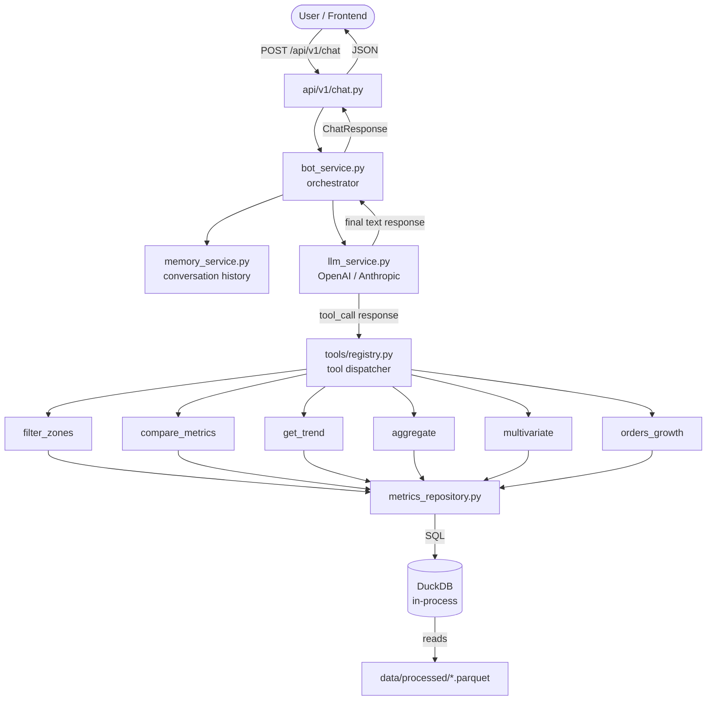

# Architecture

## Request Flow



## Layer Responsibilities

| Layer | Module | Responsibility |
|---|---|---|
| HTTP | `api/v1/chat.py` | Deserialize request, call bot_service, serialize response |
| Orchestration | `services/bot_service.py` | Drive the LLM ↔ tool loop until final answer |
| LLM Abstraction | `services/llm_service.py` | Provider-agnostic chat completion with tool use |
| Memory | `services/memory_service.py` | Per-session message history (in-process dict) |
| Tool Registry | `tools/registry.py` | Maps tool names → JSON schema + Python handler |
| Tools | `tools/*.py` | Pure functions: take params, call repository, return structured data |
| Repository | `repositories/metrics_repository.py` | SQL queries on DuckDB; returns pandas DataFrames |
| Data | `repositories/database.py` | DuckDB connection lifecycle; registers parquet views |
| Prompts | `prompts/system_prompt.py` | Builds the system prompt injected on every conversation |
| Config | `core/config.py` | Pydantic Settings; single source of truth for env vars |

## Tool-Use Loop

```
1. User message arrives
2. bot_service prepends system prompt + conversation history
3. llm_service calls provider with tools list attached
4. If provider returns tool_call:
     a. Registry dispatches to the correct handler
     b. Handler queries DuckDB via repository
     c. Result appended to messages as tool response
     d. Loop back to step 3
5. Provider returns final text → returned to user
6. Both user message and assistant reply persisted in memory_service
```

## Data Pipeline

```
Bot_datos.xlsx
    └── RAW_INPUT_METRICS sheet ──▶ metrics.parquet
    └── RAW_ORDERS sheet        ──▶ orders.parquet
    └── RAW_SUMMARY sheet       ──▶ summary.parquet

DuckDB registers each parquet as a view on startup.
All analytical queries run against these views.
```
